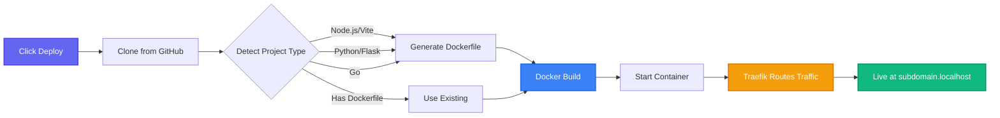

# miniPaaS

[](https://opensource.org/licenses/MIT)
[](https://nodejs.org/)
[](https://www.docker.com/)

**Test your deployments before production breaks.**

Local PaaS for simulating production deployments on your machine. Catches port issues, build failures, and routing problems before they hit real servers.

## Screenshots

<div align="center">
  
  <p><em>Dashboard with deployed projects</em></p>

  
  <p><em>Real-time deployment logs</em></p>
</div>

## How It Works



**GitHub → Build → Deploy → Test at `yourapp.localhost`**

## What It Does

- Auto-detects project type (Node.js, Python, Go, static sites)
- Builds Docker images and routes traffic through Traefik
- Shows real-time pipeline status with health checks
- Catches bad gateway errors, port mismatches, and build failures
- Manages environment variables and persistent storage

## Requirements

- Docker Desktop
- GitHub account for OAuth

## Quick Start

```bash
git clone https://github.com/usr-wwelsh/miniPaaS.git
cd miniPaaS

# Create GitHub OAuth app at https://github.com/settings/developers
# Use http://localhost:3000/auth/github/callback as callback URL

cp .env.example .env
# Add your GITHUB_CLIENT_ID and GITHUB_CLIENT_SECRET

docker-compose up -d
```

Open **http://localhost:3000**, connect your GitHub account, and start deploying.

## Project Structure

```
miniPaaS/
├── control-plane/          # Node.js backend
│   ├── config/            # Database, Docker, GitHub config
│   ├── routes/            # API routes
│   ├── services/          # Business logic
│   ├── websockets/        # WebSocket server
│   ├── middleware/        # Express middleware
│   └── utils/             # Helper utilities
├── dashboard/             # Frontend
│   ├── css/              # Stylesheets
│   ├── js/               # JavaScript
│   └── assets/           # Static assets
├── database/              # SQL schemas
├── traefik/              # Traefik configuration
└── docker-compose.yml    # Infrastructure orchestration
```

## Supported Languages

Auto-detects Node.js, Python, Go, and static HTML sites. Existing Dockerfiles work too.

## Architecture

```
Browser → Traefik → Control Plane + User Containers → PostgreSQL
```

## License

MIT
