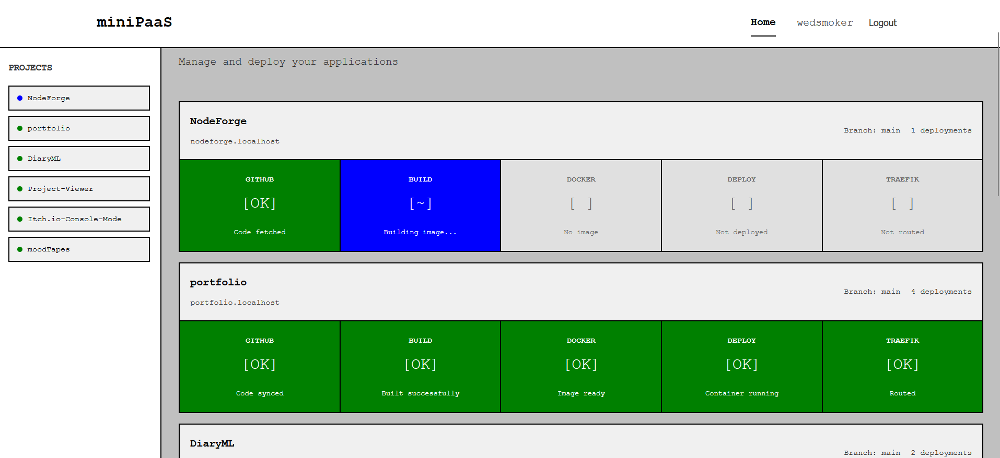
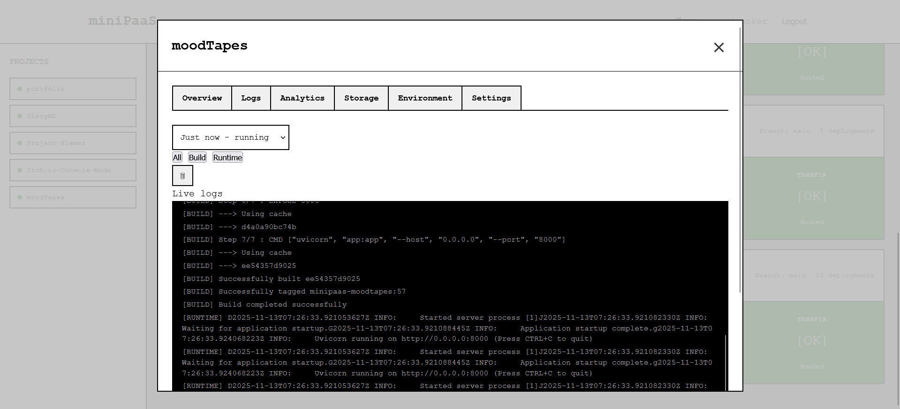

# miniPaaS

[](https://opensource.org/licenses/MIT)
[](https://nodejs.org/)
[](https://www.docker.com/)
[](https://www.postgresql.org/)
[](https://traefik.io/)
[](https://github.com/wedsmoker/miniPaaS/pulls)

A self-hosted Platform as a Service (PaaS) that runs entirely on your local machine. Deploy applications from GitHub repositories with automatic builds, real-time logs, analytics, and environment variable management.

## Screenshots

<div align="center">
  
  <p><em>Dashboard with deployed projects</em></p>

  
  <p><em>Real-time deployment logs</em></p>
</div>

## Features

- **GitHub Integration**: Connect repositories via OAuth and deploy with one click
- **Automatic Builds**: Detects project type and builds Docker images automatically
- **Subdomain Routing**: Access deployments at `appname.localhost`
- **Real-time Logs**: Stream build and runtime logs via WebSocket
- **Analytics Dashboard**: Track HTTP requests, visitors, and resource usage
- **Environment Variables**: Auto-detect and manage environment variables
- **Clean UI**: Professional, modern dashboard with dark theme

## Technology Stack

- **Backend**: Node.js + Express
- **Frontend**: Vanilla HTML/CSS/JavaScript with Chart.js
- **Database**: PostgreSQL 15
- **Containerization**: Docker + Docker Compose
- **Reverse Proxy**: Traefik v3
- **Real-time**: WebSocket for log streaming

## Prerequisites

- Docker Desktop (Windows/Mac) or Docker Engine + Docker Compose (Linux)
- Node.js 20+ (for local development)
- GitHub account
- Git

## Quick Start

### 1. Clone the Repository

```bash
git clone <repository-url>
cd miniPaaS
```

### 2. Create GitHub OAuth App

1. Go to https://github.com/settings/developers
2. Click "New OAuth App"
3. Fill in the details:
   - **Application name**: miniPaaS Local
   - **Homepage URL**: `http://localhost:3000`
   - **Authorization callback URL**: `http://localhost:3000/auth/github/callback`
4. Click "Register application"
5. Note down your **Client ID** and **Client Secret**

### 3. Configure Environment Variables

```bash
cp .env.example .env
```

Edit `.env` and add your GitHub credentials:

```env
GITHUB_CLIENT_ID=your_client_id_here
GITHUB_CLIENT_SECRET=your_client_secret_here
SESSION_SECRET=random_string_for_sessions
ENCRYPTION_KEY=your_32_character_encryption_key
```

### 4. Start the Platform

```bash
docker-compose up -d
```

This will start:
- PostgreSQL database
- Traefik reverse proxy
- miniPaaS control plane

### 5. Access the Dashboard

Open your browser and navigate to: **http://localhost:3000**

Click "Connect with GitHub" to authenticate and start deploying applications.

## Deploying Your First Application

1. **Create a New Project**
   - Click "New Project" in the dashboard
   - Select a GitHub repository
   - Choose a subdomain (e.g., `myapp` will be accessible at `myapp.localhost`)
   - Configure the port your app runs on (default: 3000)

2. **Deploy**
   - Click "Deploy Now" on your project
   - Watch the build logs in real-time
   - Once deployed, visit `http://yourapp.localhost`

3. **Manage Environment Variables**
   - Navigate to the "Environment" tab
   - Add required environment variables
   - Redeploy for changes to take effect

## Project Structure

```
miniPaaS/
├── control-plane/          # Node.js backend
│   ├── config/            # Database, Docker, GitHub config
│   ├── routes/            # API routes
│   ├── services/          # Business logic
│   ├── websockets/        # WebSocket server
│   ├── middleware/        # Express middleware
│   └── utils/             # Helper utilities
├── dashboard/             # Frontend
│   ├── css/              # Stylesheets
│   ├── js/               # JavaScript
│   └── assets/           # Static assets
├── database/              # SQL schemas
├── traefik/              # Traefik configuration
└── docker-compose.yml    # Infrastructure orchestration
```

## Supported Project Types

miniPaaS automatically detects and builds:

- **Node.js**: Projects with `package.json`
- **Python**: Projects with `requirements.txt`
- **Go**: Projects with `go.mod`
- **Static Sites**: Projects with `index.html`

If your project has a `Dockerfile`, it will be used directly.

## Architecture

```
┌─────────────┐
│   Browser   │
└──────┬──────┘
       │
       ▼
┌─────────────────────────┐
│  Traefik (Port 80)      │
│  Routes *.localhost     │
└────┬────────────────┬───┘
     │                │
     ▼                ▼
┌──────────┐    ┌──────────────┐
│ Control  │    │ User         │
│ Plane    │    │ Containers   │
│ (API +   │    │ (Your Apps)  │
│ WebSocket)│   │              │
└────┬─────┘    └──────────────┘
     │
     ▼
┌──────────┐
│PostgreSQL│
└──────────┘
```

## API Endpoints

### Authentication
- `GET /auth/github` - Initiate GitHub OAuth
- `GET /auth/github/callback` - OAuth callback
- `GET /auth/user` - Get current user
- `GET /auth/logout` - Logout

### Projects
- `GET /api/projects` - List all projects
- `POST /api/projects` - Create new project
- `GET /api/projects/:id` - Get project details
- `PUT /api/projects/:id` - Update project
- `DELETE /api/projects/:id` - Delete project
- `GET /api/projects/repositories` - List GitHub repositories

### Deployments
- `POST /api/projects/:id/deploy` - Deploy project
- `GET /api/deployments/:id` - Get deployment details
- `POST /api/deployments/:id/stop` - Stop deployment
- `DELETE /api/deployments/:id` - Delete deployment

### Logs
- `GET /api/deployments/:id/build-logs` - Get build logs
- `GET /api/deployments/:id/runtime-logs` - Get runtime logs
- `WS /ws/logs` - WebSocket for real-time logs

### Analytics
- `GET /api/projects/:id/analytics` - Get analytics data

### Environment Variables
- `GET /api/projects/:id/env` - List environment variables
- `POST /api/projects/:id/env` - Add environment variable
- `PUT /api/projects/:id/env/:key` - Update environment variable
- `DELETE /api/projects/:id/env/:key` - Delete environment variable

## Development

### Running Locally (without Docker)

1. Start PostgreSQL:
```bash
docker run -d -p 5432:5432 -e POSTGRES_PASSWORD=paaspass -e POSTGRES_USER=paasuser -e POSTGRES_DB=paasdb postgres:15-alpine
```

2. Install dependencies:
```bash
cd control-plane
npm install
```

3. Start the server:
```bash
npm run dev
```

### Database Migrations

The database schema is automatically initialized on first run. For manual initialization:

```bash
docker-compose exec postgres psql -U paasuser -d paasdb -f /docker-entrypoint-initdb.d/init.sql
```

## Troubleshooting

### Cannot access *.localhost domains

**Windows/Mac**: Should work out of the box.

**Linux**: Add to `/etc/hosts`:
```
127.0.0.1 localhost *.localhost
```

Or use dnsmasq for wildcard DNS.

### Docker build fails

Check build logs in the dashboard. Common issues:
- Missing Dockerfile (miniPaaS will generate one)
- Incorrect port configuration
- Missing dependencies in package.json

### Container won't start

Check deployment logs. Common issues:
- Port mismatch between Dockerfile EXPOSE and project settings
- Missing environment variables
- Application crashes on startup

### WebSocket connection fails

Ensure:
- Control plane is running
- No firewall blocking WebSocket connections
- Using correct protocol (ws:// not wss://)

## Security Notes

For local development, this setup uses:
- Insecure Traefik dashboard (acceptable for localhost)
- HTTP only (no SSL)
- Session secrets should be changed from defaults

**For production deployment:**
- Enable HTTPS with Let's Encrypt
- Secure Traefik dashboard with authentication
- Use strong session secrets
- Implement rate limiting
- Add CSRF protection
- Enable audit logging

## Roadmap

- [ ] Automatic deployments via GitHub webhooks
- [ ] Rollback to previous deployments
- [ ] Multi-environment support (staging, production)
- [ ] Custom domains with SSL
- [ ] Database service provisioning
- [ ] Horizontal scaling support
- [ ] CI/CD pipeline integration
- [ ] CLI tool for deployments

## Contributing

Contributions are welcome! Please feel free to submit a Pull Request.

## License

MIT License - see LICENSE file for details

## Acknowledgments

Built with inspiration from Railway, Vercel, and Heroku.
